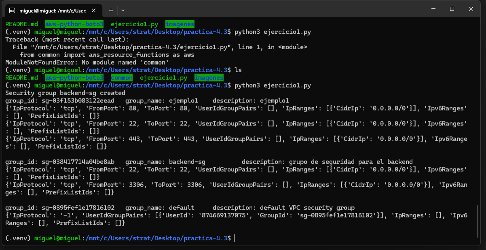
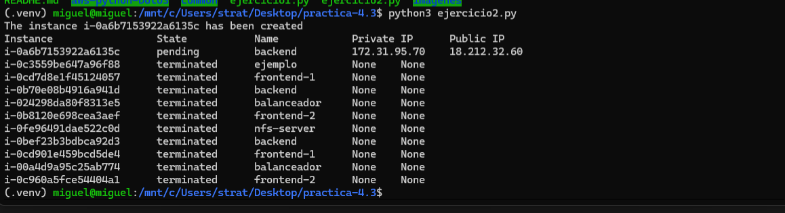
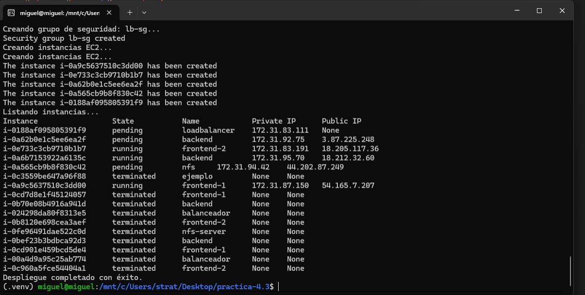
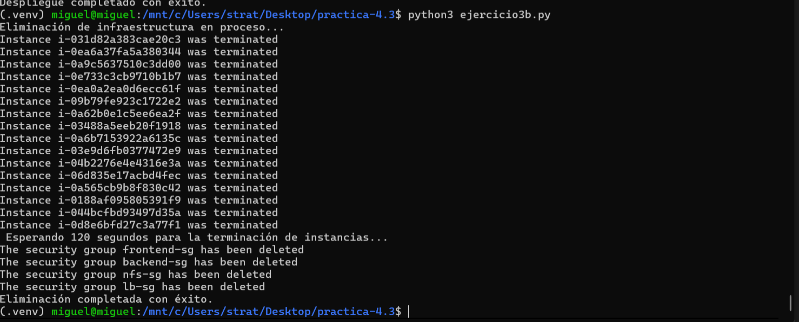

# practica-4.3
Ejercicio 1
Escriba un script de Python para crear un grupo de seguridad con el nombre backend-sg. Añada las siguientes reglas al grupo de seguridad:

Acceso SSH (puerto 22/TCP) desde cualquier dirección IP.
Acceso al puerto 3306/TCP desde cualquier dirección IP.

Ejercicio 2
Escriba un script de Python para crear una instancia EC2 que tengas las siguientes características.

Identificador de la AMI: ami-08e637cea2f053dfa. Esta AMI se corresponde con la imagen Red Hat Enterprise Linux 9 (HVM).
Número de instancias: 1
Tipo de instancia: t2.micro
Clave privada: vockey
Grupo de seguridad: backend-sg
Nombre de la instancia: backend

Ejercicio 3
Crea un script para crear la infraestructura de la práctica propuesta por el profesor.

Crea un script para eliminar la infraestructura de la práctica propuesta por el profesor.
